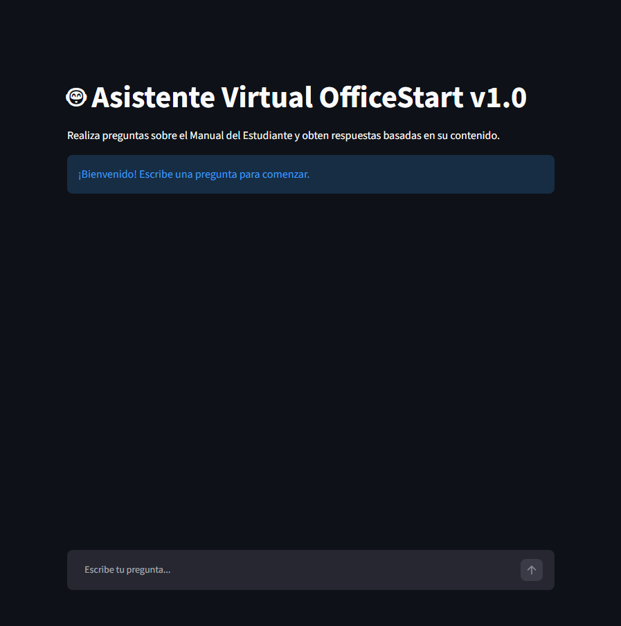
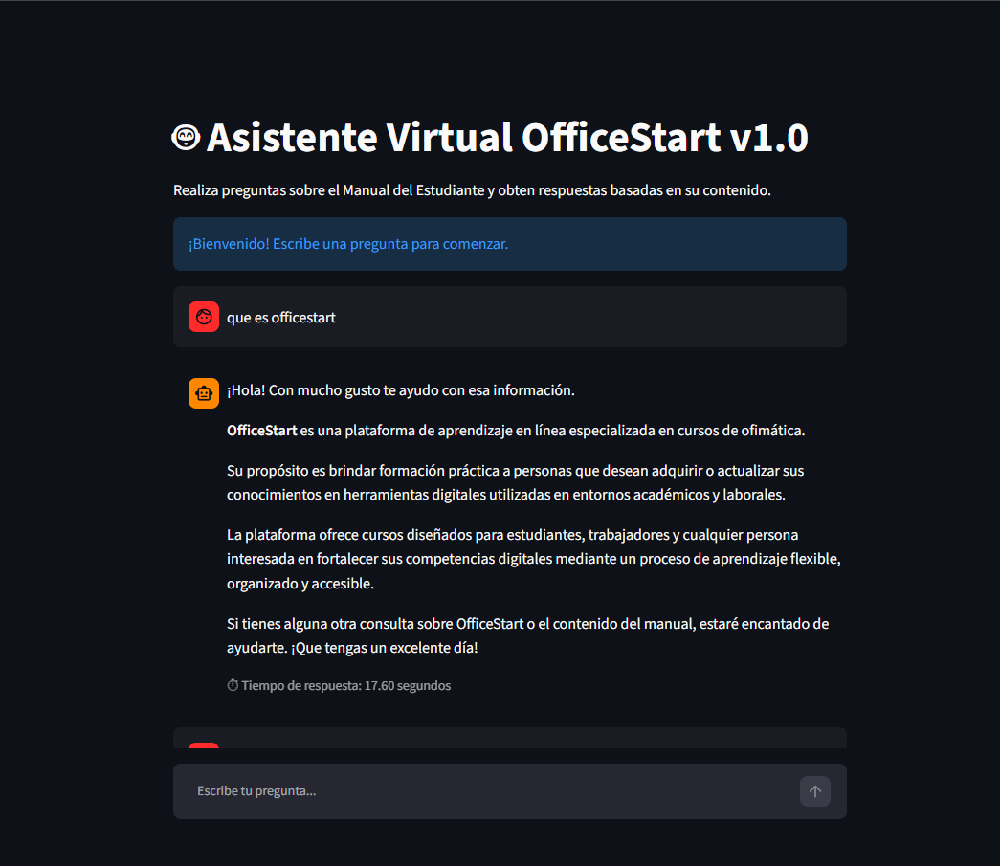
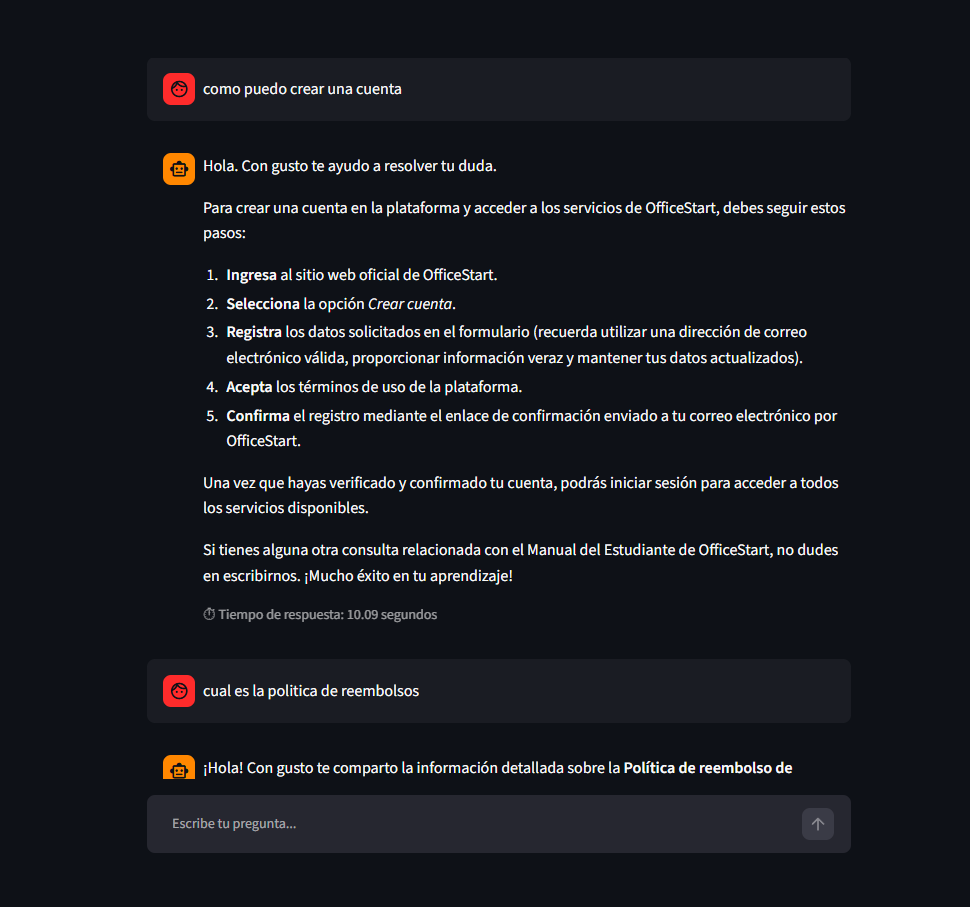
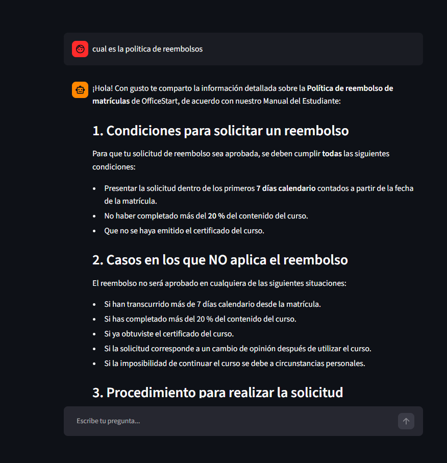
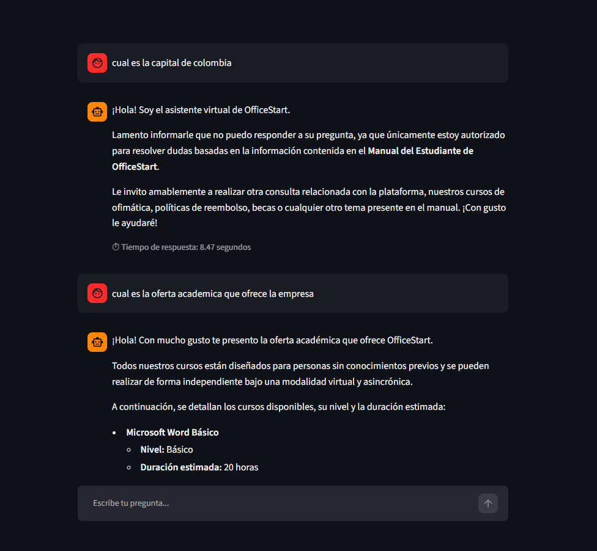
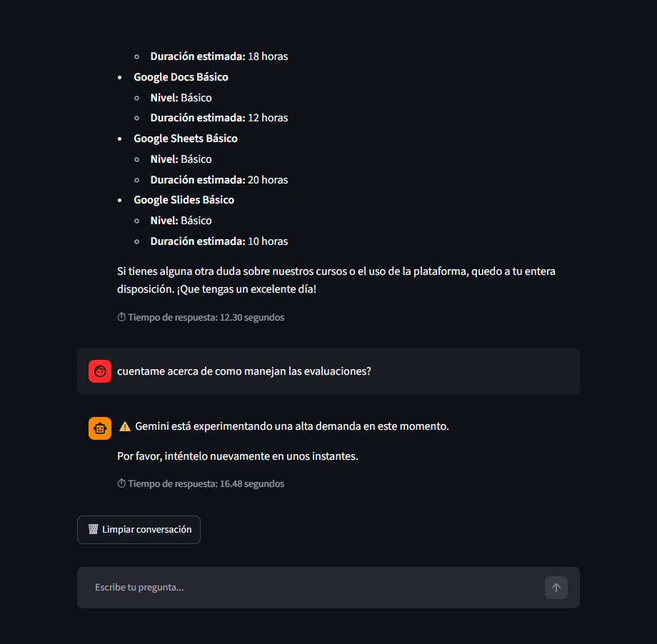

<div align="center">

# 🤖 OfficeStart Agent IA

#### Agente conversacional impulsado por inteligencia artificial para consultar el Manual del Estudiante de OfficeStart

</div>

---

## 📑 Contenido

- [📖 Descripción](#-descripción)
- [✨ Características](#-características)
- [🛠 Tecnologías utilizadas](#-tecnologías-utilizadas)
- [🏗 Arquitectura del proyecto](#-arquitectura-del-proyecto)
- [📂 Estructura del proyecto](#-estructura-del-proyecto)
- [⚙ Instalación y ejecución](#-instalación-y-ejecución)
- [📸 Capturas](#-capturas)
- [🌐 Demo](#-demo)
---

## 📖 Descripción

**OfficeStart Agent IA** es un agente de inteligencia artificial, diseñado para responder consultas sobre el **Manual del Estudiante de OfficeStart** mediante lenguaje natural.

El agente utiliza el modelo **Google Gemini** para interpretar las preguntas del usuario y generar respuestas fundamentadas exclusivamente en la información contenida en el manual, garantizando que las respuestas se mantengan alineadas con el contenido oficial del documento.

Para facilitar la interacción con el usuario, el agente se integra con una interfaz desarrollada en **Streamlit**, proporcionando una experiencia de consulta sencilla, intuitiva y accesible.

---

## ✨ Características

- 📄 Consulta el contenido del **Manual del Estudiante de OfficeStart** mediante lenguaje natural.
- 🤖 Genera respuestas utilizando el modelo **Google Gemini**.
- 💬 Interfaz conversacional desarrollada con **Streamlit**.
- 📝 Mantiene el historial de la conversación durante la sesión.
- ⏱️ Muestra el tiempo de respuesta generado por el modelo.
- 🔄 Permite limpiar el historial de conversación con un solo clic.
- ⚠️ Gestiona los errores más comunes de la API mostrando mensajes amigables al usuario.
- 📚 Responde únicamente con información basada en el contenido del manual cargado.

---

## 🛠 Tecnologías utilizadas

|     Tecnología    |               Descripción                          |
|-------------------|----------------------------------------------------|
| Python 3          | Lenguaje principal del proyecto                    |
| Streamlit         | Desarrollo de la interfaz web                      |
| Google Gemini API | Generación de respuestas mediante IA               |
| pypdf             | Extracción del contenido del Manual del Estudiante |
| python-dotenv     | Gestión de variables de entorno                    |

---

## 🏗 Arquitectura del proyecto

```text
              Inicio de la aplicación
                     │
                     ▼
              📄 Carga del Manual del Estudiante
                     (@st.cache_data)
                     │
                     ▼
              👤 Usuario
                     │
                     ▼
              💬 Interfaz Streamlit
                     │
                     ▼
              🤖 OfficeStart Agent IA
                     │
        ┌────────────┼──────────────┐
        │            │              │
        ▼            ▼              ▼
       📝 Reglas    📄 Manual  ❓ Pregunta
        └────────────┼──────────────┘
                     ▼
              🧠 Google Gemini API
                     │
                     ▼
              💡 Respuesta
                     │
                     ▼
              💬 Interfaz Streamlit
                     │
                     ▼
              👤 Usuario
```

La arquitectura del agente sigue el siguiente flujo de ejecución:

1. **Carga del conocimiento:** Al iniciar la aplicación, el contenido del **Manual del Estudiante** se carga una única vez y se almacena en memoria mediante el sistema de caché de **Streamlit** (`@st.cache_data`).

2. **Recepción de la consulta:** El usuario interactúa con la interfaz desarrollada en **Streamlit** y envía una pregunta utilizando lenguaje natural al agente.

3. **Construcción del contexto:** **OfficeStart Agent IA** reúne tres elementos para construir la solicitud que será enviada al modelo:
   - 📝 Las reglas definidas en el **prompt del sistema**.
   - 📄 El contenido previamente cargado del **Manual del Estudiante**.
   - ❓ La pregunta realizada por el usuario.

4. **Generación de la respuesta:** El contexto construido es enviado a **Google Gemini**, que procesa toda la información recibida y genera una respuesta fundamentada exclusivamente en el contenido del Manual del Estudiante.

5. **Presentación del resultado:** La respuesta generada se muestra al usuario en la interfaz conversacional de **Streamlit**. Posteriormente, la respuesta y el tiempo de procesamiento se almacenan en el historial de la sesión para conservar la conversación durante la interacción del usuario.

---

## 📂 Estructura del proyecto

```text
officestart-agent-ia/
│
├── data/
│   └── Manual_del_Estudiante_OfficeStart_v1.0.pdf
│
├── src/
│   ├── config.py
│   ├── llm.py
│   ├── pdf_loader.py
│   ├── user_input.py
│   └── __init__.py
│
├── .env
├── .env.example
├── .gitignore
├── app.py
├── README.md
└── requirements.txt
```

### Descripción de la estructura

| Archivo / Carpeta | Responsabilidad |
|-------------------|-----------------|
| `data/` | Contiene el **Manual del Estudiante de OfficeStart**, utilizado como fuente de conocimiento del agente. |
| `src/config.py` | Centraliza las constantes y configuraciones generales utilizadas por la aplicación. |
| `src/pdf_loader.py` | Carga y extrae el contenido del Manual del Estudiante para convertirlo en el contexto del agente. |
| `src/llm.py` | Construye el prompt, gestiona la comunicación con Google Gemini y genera las respuestas del agente. |
| `src/user_input.py` | Gestiona el procesamiento y la validación de las consultas realizadas por el usuario. |
| `app.py` | Punto de entrada de la aplicación e implementación de la interfaz conversacional desarrollada con Streamlit. |
| `requirements.txt` | Lista las dependencias necesarias para ejecutar el proyecto. |
| `.env.example` | Plantilla con las variables de entorno requeridas para configurar la aplicación. |
| `.env` | Almacena las credenciales y configuraciones sensibles del proyecto (no se incluye en el repositorio). |
| `README.md` | Documentación principal del proyecto. |

---

## ⚙ Instalación y ejecución

Siga los siguientes pasos para configurar y ejecutar **OfficeStart Agent IA** en su equipo.

### 1. Clonar el repositorio

Clone el repositorio en su equipo utilizando el siguiente comando:

```bash
git clone https://github.com/Cuivador/officestart-agent-ia.git
```

### 2. Acceder al directorio del proyecto

Ingrese al directorio raíz del proyecto.

```bash
cd officestart-agent-ia
```

### 3. Crear un entorno virtual

Se recomienda utilizar un entorno virtual para aislar las dependencias del proyecto.

```bash
python -m venv .venv
```

### 4. Activar el entorno virtual

Active el entorno virtual según su sistema operativo.

**Windows**

```bash
.venv\Scripts\activate
```

**Linux / macOS**

```bash
source .venv/bin/activate
```

### 5. Instalar las dependencias

Instale todas las dependencias necesarias para ejecutar la aplicación.

```bash
pip install -r requirements.txt
```

### 6. Configurar las variables de entorno

En la raíz del proyecto encontrará el archivo **`.env.example`**, que contiene la estructura de las variables de entorno requeridas por la aplicación.

Cree una copia de este archivo con el nombre **`.env`** y reemplace el valor de la variable **`GEMINI_API_KEY`** por su propia API Key de Google Gemini.

```env
GEMINI_API_KEY=TU_API_KEY
```

Puede obtener una API Key desde **Google AI Studio**:

https://aistudio.google.com/app/apikey

### 7. Ejecutar la aplicación

Con el entorno virtual activado, inicie la aplicación con el siguiente comando:

```bash
streamlit run app.py
```

Una vez iniciada, Streamlit mostrará una dirección local similar a:

```text
Local URL: http://localhost:8501
```

Abra esa dirección en su navegador para comenzar a interactuar con **OfficeStart Agent IA**.

---

## 📸 Capturas

A continuación se presentan algunas capturas de la aplicación durante su funcionamiento.

### 🏠 Pantalla principal

Vista inicial de **OfficeStart Agent IA**, donde el usuario puede comenzar a interactuar con el asistente mediante lenguaje natural.



### 📄 Consulta basada en el Manual del Estudiante

Tres ejemplos de consultas cuya respuesta fue generada utilizando la información contenida en el Manual del Estudiante de OfficeStart.

#### 🔎 Ejemplo 1 – ¿Que es OfficeStart?



#### 🔎 Ejemplo 2 – ¿Como puedo crear una cuenta?



#### 🔎 Ejemplo 3 – ¿Cual es la politica de reembolsos?



### 🚫 Consulta fuera del alcance del Manual

Ejemplo del comportamiento del agente cuando el usuario realiza una pregunta que no está relacionada con el contenido del Manual del Estudiante.



### ⚠️ Manejo de errores del servicio

Cuando el servicio de Google Gemini presenta alta demanda o se encuentra temporalmente no disponible, la aplicación informa la situación mediante un mensaje amigable para el usuario.



## 🌐 Demo

Puedes acceder a la aplicación desplegada desde el siguiente enlace:

🔗 https://officestart-agent-ia.streamlit.app/